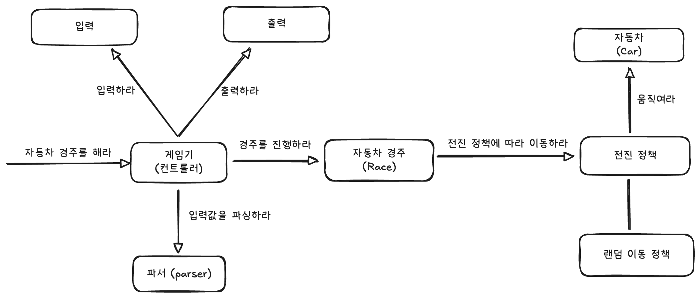

# 구현 기능 목록

> 구현해야 할 기능들의 목록입니다.
> 요구사항에 맞춰 각 기능을 커밋 단위로 설정하였습니다.
>
> 각 기능은 `feat` 태그를 통해 커밋되었습니다.

- [X] 자동차 이름을 입력받는다.
- [X] 시도 횟수를 입력받는다.
- [X] 콘솔에 메시지를 출력한다.
- [X] 입력받은 문자열을 쉼표로 파싱한다.
- [X] 무작위 값을 사용해 이동 여부를 결정한다
- [X] 위치를 증가할 자동차 선택를 선택한다.
- [X] 자동차의 위치를 증가시킨다.
- [X] 자동차 경기 진행 상황 출력한다.
- [X] 우승자를 결정한다.
- [X] 우승자를 출력한다.

# 추가 개선 사항 목록

> 기능이라고 보기 어려운, 코드의 품질 향상을 위한 체크리스트입니다.
>
> 각 항목에 관해 체크하기 위한 용도로 작성되었습니다.

- [X] 단위 테스트 작성
- [X] 통합 테스트 작성
- [X] 리팩토링
    - [X] Loose Coupling & High Cohesion (느슨한 결합과 높은 응집도)를 지켰는가?
    - [X] Tell, Don't Ask 원칙을 지켰는가?
    - [X] 각 클래스 및 메서드의 책임을 명확하게 분리했는가?
    - [X] 캡슐화가 잘 지켜졌는가?
    - [X] YAGNI(You Ain't Gonna Need It) 원칙을 지켰는가?
    - [X] KISS (Keep It Simple, Stupid) 원칙을 지켰는가?
    - [X] DRY (Don't Repeat Yourself) 원칙을 지켰는가?

> 다음은 1주차 피드백과 요구사항으로부터 추가된 코드 품질 향상 체크리스트입니다.

- [X] 커밋 컨벤션을 잘 지켰는가?
- [X] 코드 컨벤션을 잘 지켰는가?
- [X] 메서드가 한 가지 일만 하고 있는가?
- [X] 변수명, 메서드명이 명확한가?
- [X] indent(들여쓰기)는 2를 넘지 않는가?
- [X] 불필요한 주석은 없는가?
- [X] 공백 라인을 의미 있게 사용했는가?

# 추가 커밋 사항

> 추가적으로 리팩토링 및 수정 사항이 발생하는 경우 아래의 커밋 컨벤션에 맞춰
> 추가적인 커밋 사항이 작성됩니다.

커밋은 다음의 [AngularJS Git Commit Message Conventions](https://gist.github.com/stephenparish/9941e89d80e2bc58a153)에 맞추어
진행하였습니다. 
위의 커밋 컨벤션을 준수하기 위해 아래와 같은 태그를 사용하였습니다.

- feat (feature)
- fix (bug fix)
- docs (documentation)
- style (formatting, missing semi colons, …)
- refactor
- test (when adding missing tests)
- chore (maintain)

# 개인적 2주차 목표

- 빠르게 구현하고, 객체지향의 특성을 적극 활용해 리팩토링한다.
- 객체지향이 무엇이고 왜 좋으며, 객체지향을 통해 달성해야 하는 목표는 무엇인지 생각한다.
- 객체지향의 본질에 대해 고민하고, 객체지향 설계 원칙을 적용한다.
- 예외 처리에 대해 고민하고 적용한다.
- 테스트 코드 작성에 대해 고민하고 적용한다.
- 성장에 대해 고민하고, 나만의 성장 지표를 세운다.
- 좋은 설계에 대해 고민하고, 어떤 부분에 대해서 좋은 설계인지를 고민한다.

# 설계

설계는 최소한의 설계로 시작해서 빠르게 기능을 구현해서 동작하는 프로그램을 만든 뒤,
점진적으로 리팩토링하는 방식을 채택했습니다.

### 도메인 모델(시스템 아키텍처 다이어그램)

> 위의 다이어그램은 제출 전까지 계속해서 수정됩니다. 
> 최종 제출 시점의 다이어그램이 최종 설계 다이어그램이 됩니다. 
> 설계 다이어그램은 [excalidraw](https://excalidraw.com/)로 작성되었습니다.

### 설계 방법

- 시스템의 책임을 식별한 뒤 책임을 수행할 객체를 도출했습니다.
- 객체의 책임으로부터 필요한 메시지를 식별했습니다.
- 메시지를 객체에 할당하는 방식으로 설계를 진행했습니다.
- 구현 과정에서 변경되는 사항을 반영하여 점진적으로 설계를 개선했습니다.

---

# 리팩토링 기록

> 리팩토링 과정을 어떻게 진행했는지를 기술합니다. 
> 리팩토링에 관한 내용은 가독성을 위해 최종 커밋 내역을 기반으로 수정하였습니다. 
> 따라서 리팩토링 커밋 내역과 일치하지 않을 수 있습니다.

### 리팩토링 1 - Race클래스 도입

초기 구현에서는 GameConsole에서 모든 책임을 가지고 Car 객체와 협력하는 형태였습니다.
하지만, 이는 SRP 원칙을 위반하는 동시에, 결합도가 높고 응집도가 낮아 유지보수에 매우 어려운 구조라고 판단했습니다.
따라서 Race 객체를 도입해 경주에 관련된 책임을 모두 위임했습니다. 또한 GameConsole을 RaceController로 이름을 변경했습니다.
이를 통해 RaceController은 입력과 출력, 흐름 제어에만 집중할 수 있게 되었습니다.

RaceController를 구축하는 과정에서 Controller의 역할이 무엇일까 고민했습니다.
왜냐하면 Race라는 객체를 도입하면서 race.start() 하나로 경주를 처리하면 Controller의 역할이 너무 단순해지는 것 아닌가 싶었기 때문입니다.
하지만, 이 경우 각 레이스의 상황을 출력하기 위해서는 도메인 모델 내부에서 입/출력과 강하게 결합된다고 생각했습니다.
따라서 Controller는 흐름을 제어하고 도메인과 뷰 사이를 오케스트레이션 하는 역할이라는 것을 깨달았습니다.
이를 통해서 Controller의 역할을 제대로 이해할 수 있었습니다.  

### 리팩토링 2 - 도메인 응집도 강화와 컬렉션 보호

이전에는 GameConsole이 List<Car>를 직접 다루며 경주의 모든 로직을 알고 있었습니다.
이는 객체지향의 **“Tell, Don’t Ask”** 원칙을 위배하는 구조였습니다.
따라서 Race가 직접 Car 리스트를 관리하고 경주 로직을 수행하도록 수정했습니다.
이로써 Controller는 데이터를 꺼내서 조작하는 대신, 명령하는 형태로 단순화되었습니다.

또한 컬렉션의 불변성을 보장하기 위해 `new ArrayList<>(cars)`로 복사 후 할당하고,
`getCars()`에서는 `List.copyOf(cars)`를 반환하도록 변경했습니다.
이를 통해 외부에서 내부 상태를 변경하지 못하게 막으면서, 도메인이 스스로의 무결성을 지킬 수 있는 구조로 개선했습니다.  

### 리팩토링 3 - 입력 검증과 예외 처리의 책임 분리

기존에는 입력 검증 로직이 Controller에 존재해 과한 책임을 지고 있었습니다.
이를 해결하기 위해 InputConverter를 도입해 입력값 검증과 변환을 담당하도록 했습니다.
예외 처리 또한 일관성을 위해 상수화된 메시지로 관리하고,
단순히 IllegalArgumentException을 사용하는 방식으로 정리했습니다.

별도의 커스텀 예외를 만들지 않은 이유는 YAGNI(You Ain’t Gonna Need It) 원칙에 따라
지금 단계에서 불필요한 복잡성을 추가하지 않기 위함이었습니다. 예외를 세분화하는 것은 분명 명확한 에러 처리를 가능하게 하지만,
현재 시스템의 규모와 복잡도를 고려했을 때 일반적인 IllegalArgumentException으로도 충분히 의도를 전달할 수 있다고 판단했습니다.  

### 리팩토링 4 - 의존성 관리와 출력 책임의 재조정

RaceController가 더 이상 InputView, OutputView, InputConverter, MoveStrategy를 직접 생성하지 않도록
AppConfig에서 생성자 주입(Dependency Injection)을 하는 구조로 전환했습니다.
객체의 생성과 주입은 AppConfig에서 담당하도록 하여 결합도를 낮추고, 테스트하기 쉬운 구조로 바꾸었습니다.

출력 포매팅 책임은 처음에는 Race에서 그리고 다음에는 Controller에서 담당하도록 변경했지만, SRP 관점에서 다시 한번 고민이 들었습니다.
결국 View가 출력 형식을 책임지는 것이 더 자연스럽다고 판단해 OutputView로 이동시켰습니다.
한때 CarStatusDTO를 만들어 데이터 전달을 분리하려 했지만, 오히려 구조가 복잡해지고 이익이 적다고 느껴 DTO를 제거했습니다.
결국 View는 단순히 도메인의 `getCars()`를 사용하는 선에서 결합도를 최소화하는 것이 더 현실적이고 직관적이라는 결론을 내렸습니다.  

### 리팩토링 5 - 판단을 전략에게 위임

이전 설계에서는 Race객체가 MoveStrategy에게 이동 여부를 묻고 그에 따라 if문을 직접 판단해서 `car.move()`를 호출하여 이동을 처리했습니다
하지만, 저는 이 구조가 Tell, Don’t Ask 원칙을 위반한다고 생각했습니다. 또한, 규칙이 변경되는 경우 Race의 if문을 수정해야 하므ㅋ OCP(Open-Closed Principle)도 위반한다고
생각했습니다.
따라서 판단의 책임을 MoveStrategy에게 위임하여 `if (moveStrategy.should())` 이후 `move()` 대신,
race가 `strategy.attemptMove(car)`를 통해 car.move()를 캡슐화하도록 수정하였습니다.
그 결과 Race 객체는 어떻게 움직이는지는 몰라도 되고, 단순히 strategy에게 명령을 보내서 처리하도록 했습니다.
따라서 새로운 기능 추가 시에 Strategy 구현체만 추가하면 되는, 유연하고 확장 가능한 설계를 완성할 수 있었습니다

---

# 구현과 리팩토링 속에서의 고민

### 객체지향에 관한 고민

처음에는 객체지향의 본질이 책임과 협력이라는 개념으로만 머릿속에 존재했습니다.
책임이란 단어는 익숙했지만, 실제 코드에서 그것이 어떻게 드러나는지는 분명하게는 이해하지 못했습니다.
하지만 이번 프로젝트에서 직접 객체의 역할을 정의하고, 각 책임을 어떻게 분리할지 고민하는 과정을 거치면서
객체지향에 관한 이해가 훨씬 깊어졌다고 생각합니다.

객체지향(Object-Oriented)이란 말 그대로 “객체를 중심으로 사고하라”는 뜻입니다.
즉, 시스템을 구성하는 객체들이 서로 협력하여 문제를 해결하는 구조를 만드는 것이 핵심이라고 할 수 있습니다.
그동안 코드를 작성할 때는 기능과 데이터 위주로 생각했다면, 이제는 **“이 책임을 누가 가져야 하는가”**,
**“이 객체가 다른 객체와 어떤 메시지를 주고받아야 하는가”** 를 먼저 고민하게 되었습니다.

이러한 생각은 코드의 확장성에도 직접적인 영향을 미칠 수 있었습니다.
예를 들어 MoveStrategy나 Race의 역할을 분리했을 때, 각 객체는 명확한 책임을 가지게 되었고
새로운 정책을 추가하거나 규칙을 수정할 때도 기존 코드를 변경할 필요가 줄었습니다.
그 결과 확장에는 열려 있고, 수정에는 닫힌(OCP) 구조를 자연스럽게 달성할 수 있었습니다.

이 경험을 통해 객체지향은 단순히 코드를 모듈화하는 개념이 아니라,
변화에 유연하게 대응할 수 있는 시스템을 설계하는 철학이라는 것을 배웠습니다.

특히 객체지향의 본질은 **객체들이 서로 협력하며 책임을 나누는 데**에 있고,
그 협력을 통해 **낮은 결합도와 높은 응집도를 달성하는 것**이 궁극적인 목표라는 것을 깨달았습니다.
또한, 객체지향을 추구했을 때 테스트 코드 작성이 더욱 쉬워지고, 시스템의 확장성 또한 자연스럽게 확보된다는 점을 직접 체감할 수 있었습니다.

### 좋은 설계란 무엇일까

이번 구현과 리팩토링을 하며 정말 많이 고민한 부분은 **좋은 설계란 무엇일까**였습니다.
곰곰이 생각하니, '좋은 설계'는 그 자체로 절대적인 기준이 존재하지 않는 개념이라고 생각했습니다.
무엇을 위한 설계이고, 어떤 맥락에서 '좋다'를 정의하느냐에 따라 해석이 달라질 수 있다고 생각했습니다.

따라서 좋은 설계란 특정 형태가 아닌 주어진 맥락 속에서 합리적인 선택으로 정의되어야 한다고 생각했고,
그러한 능력을 갖추는 것이 개발자로서 중요한 역량이라고 느꼈습니다.
제가 2주 차 프로젝트를 진행하면서 얻은 저만의 좋은 설계의 기준은 다음과 같습니다.
> 좋은 설계는 변경에 강하고, 이해하기 쉬워야 한다.

이는 단순한 코드의 구조, 다양한 패턴의 적용 여부를 떠나
변경을 중심에 두고 설계가 이루어져야 하며, 누군가가 코드를 봤을 때 쉽게 이해할 수 있어야 한다는 의미입니다.
리팩터링 과정에서 불필요한 추상화를 제거하고, 인터페이스와 클래스를 필요시에만 도입하려 했던 이유도 이 지점으로부터 기인했습니다.

이 프로젝트를 통해 좋은 설계가 하나의 완벽한 것이 아닌, 균형으로부터 비롯된다고 생각했습니다.
모든 설계는 기능의 양이 아닌, 어떤 기준으로 어떤 선택을 해서 trade-off를 했는가에 달려 있다고 생각합니다.
요구사항과 상황에 맞춰 트레이드 오프를 고려하고, 그 속에서 적절히 조정하는 것이 개발자(엔지니어)로서 가장 중요한 역량 중 하나임을 깨달았습니다.

### 고민의 밀도

AI로 인해 집중력이 떨어지고 고민하지 않는 시대에서 중요한 것은 '고민의 밀도'라고 생각했습니다.
즉, 깊이 있게 고민하고 성찰하는 습관이 중요하다고 생각했습니다.

이번 구현과 리팩토링 과정을 통해 가장 크게 배운 점은,
성장은 기능을 얼마나 많이 구현했는가가 아니라 얼마나 깊이 있게 사고했는가에서 비롯된다는 것이었습니다.
예전에는 작동하는 코드를 만드는 데 집중했다면, 이번에는 각 구조와 책임 분리에 담긴 의도를 명확히 설명할 수 있을 때까지 코드를 들여다보았습니다.

"왜 이렇게 동작해야 할까?" 
"더 나은 설계는 없을까?" 
"이걸 도입했을 때 어떤 이점이 있지?"

이러한 질문들을 스스로에게 던지며, 사고의 밀도를 높이고자 노력했습니다. 이를 통해 짧은 구현 시간 속에서도 끊임없이 사고의 방향을 점검하고,
AI가 대신해 줄 수 없는 사유와 판단을 스스로 훈련하는 것이 개발자로서의 성장에 큰 기여를 한다는 것을 깨달았습니다.

즉, 이번 과정을 통해 가장 중요한 역량을 배울 수 있었습니다.

> 깊이 있는 고민은 기술보다 오래간다.

기능은 금방 사라져도, 사고의 밀도는 다음 문제를 해결하는 근육이 된다고 믿어 의심치 않습니다.
앞으로도 구현력과 더불어 깊이 사색하는 개발자로 성장하고 싶습니다.
