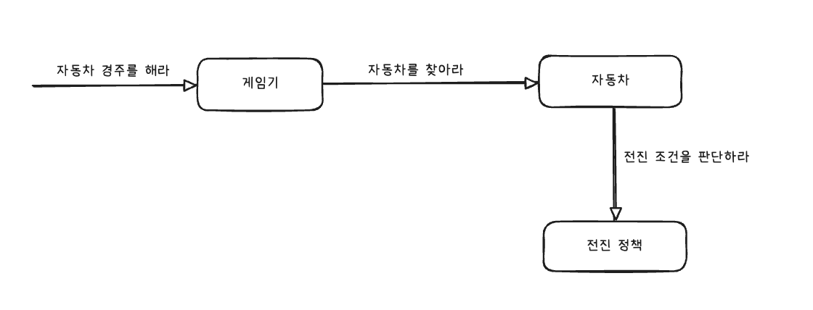

# 구현 기능 목록

> 구현해야 할 기능들의 목록입니다.
> 요구사항에 맞춰 각 기능을 커밋 단위로 설정하였습니다.
>
> 각 기능은 `feat` 태그를 통해 커밋되었습니다.

- [X] 자동차 이름을 입력받는다.
- [X] 시도 횟수를 입력받는다.
- [ ] 콘솔에 메시지를 출력한다.
- [ ] 입력받은 문자열을 쉼표로 파싱한다.
- [ ] 무작위 값을 사용해 이동 여부를 결정한다
- [ ] 위치를 증가할 자동차 선택를 선택한다.
- [ ] 자동차의 위치를 증가시킨다.
- [ ] 자동차 경기 진행 상황 출력한다.
- [ ] 우승자를 결정한다.
- [ ] 우승자를 출력한다.
- [ ] 예외 처리

# 추가 개선 사항 목록

> 기능이라고 보기 어려운, 코드의 품질 향상을 위한 체크리스트입니다.
>
> 각 항목에 관해 체크하기 위한 용도로 작성되었습니다.

- [ ] 단위 테스트 작성
- [ ] 통합 테스트 작성
- [ ] 리펙토링
    - [ ] Loose Coupling & High Cohesion (느슨한 결합과 높은 응집도)를 지켰는가?
    - [ ] Tell, Don't Ask 원칙을 지켰는가?
    - [ ] 각 클래스 및 메서드의 책임을 명확하게 분리했는가?
    - [ ] 캡슐화가 잘 지켜졌는가?
    - [ ] YAGNI(You Ain't Gonna Need It) 원칙을 지켰는가?
    - [ ] KISS (Keep It Simple, Stupid) 원칙을 지켰는가?
    - [ ] DRY (Don't Repeat Yourself) 원칙을 지켰는가?

> 다음은 1주차 피드백과 요구사항으로부터 추가된 코드 품질 향상 체크리스트입니다.

- [ ] 커밋 컨벤션을 잘 지켰는가?
- [ ] 코드 컨벤션을 잘 지켰는가?
- [ ] 메서드가 한 가지 일만 하고 있는가?
- [ ] 변수명, 메서드명이 명확한가?
- [ ] indent(들여쓰기)는 2칸인가?
- [ ] 불필요한 주석은 없는가?
- [ ] 공백 라인을 의미 있게 사용했는가?

# 추가 커밋 사항

> 추가적으로 리펙토링 및 수정 사항이 발생하는 경우 아래의 커밋 컨벤션에 맞춰
> 추가적인 커밋 사항이 작성됩니다.

커밋은 다음의 [AngularJS Git Commit Message Conventions](https://gist.github.com/stephenparish/9941e89d80e2bc58a153)에 맞추어
진행하였습니다. 
위의 커밋 컨벤션을 준수하기 위해 아래와 같은 태그를 사용하였습니다.

- feat (feature)
- fix (bug fix)
- docs (documentation)
- style (formatting, missing semi colons, …)
- refactor
- test (when adding missing tests)
- chore (maintain)

# 개인적 2주차 목표

- 빠르게 구현하고, 객체지향의 특성을 적극 활용해 리펙토링한다.
- 객체지향이 무엇이고 왜 좋으며, 객체지향을 통해 달성해야 하는 목표는 무엇인지 생각한다.
- 객체지향의 본질에 대해 고민하고, 객체지향 설계 원칙을 적용한다.
- 예외 처리에 대해 고민하고 적용한다.
- 테스트 코드 작성에 대해 고민하고 적용한다.
- 성장에 대해 고민하고, 나만의 성장 지표를 세운다.
- 좋은 설계에 대해 고민하고, 어떤 부분에 대해서 좋은 설계인지를 고민한다.

# 설계

설계는 최소한의 설계로 시작해서 빠르게 기능을 구현해서 동작하는 프로그램을 만든 뒤,
점진적으로 리팩토링하는 방식을 채택했습니다.

> 위의 다이어그램은 제출 전까지 계속해서 수정됩니다. 
> 최종 제출 시점의 다이어그램이 최종 설계 다이어그램이 됩니다. 
> 설계 다이어그램은 [excalidraw](https://excalidraw.com/)로 작성되었습니다.

### 설계 방법

- 시스템의 책임을 식별한 뒤 책임을 수행할 객체를 도출했습니다.
- 객체의 책임으로부터 필요한 메시지를 식별했습니다.
- 메시지를 객체에 할당하는 방식으로 설계를 진행했습니다.
